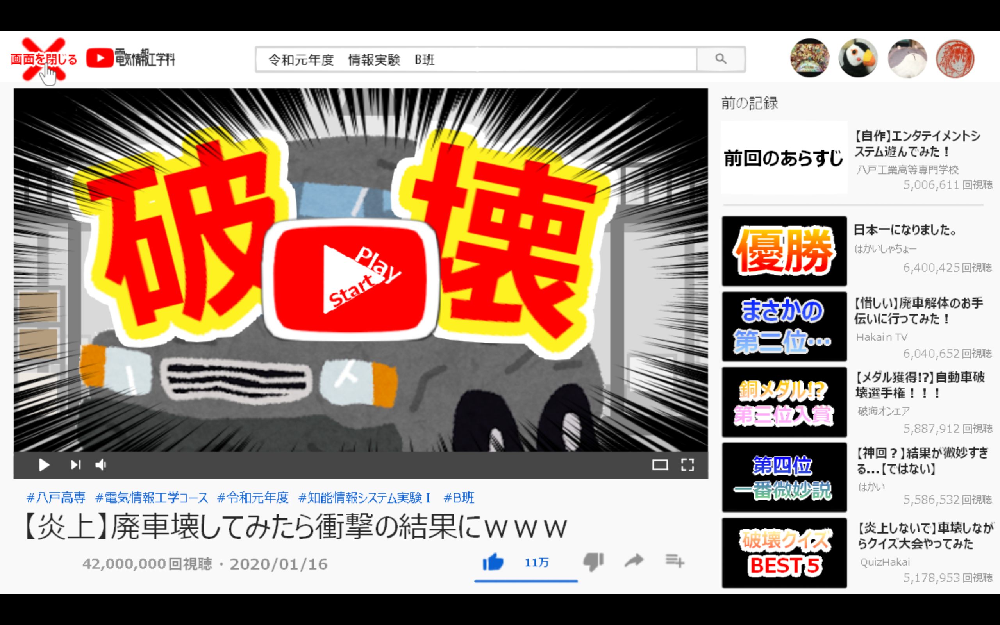

# EnjyositemitaProject
 
## Overview
八戸高専　令和元年度　知能情報システム実験　B班 
作品：【炎上】廃車壊してみたら衝撃の結果にwww ～加速度センサを用いた操作型アクションエンタテイメントシステム～ 

## Discription
専用のリモコンを手に持ち腕を振るなどのアクションを行うことで遊べるエンタテイメントシステム 
対象年齢：小学生程度

## Demo

## Usage
操作説明 
八戸高専等で使用する（リモコンがある）場合ー＞設置マニュアル、操作マニュアルを参照(./OperationExplanation/) 
 
テスト用のキー 
選択画面 
|動作|キー入力|
|:---|:---|
|決定|Enter|
|右|->|
|左|<-|

攻撃
|モーション|キー入力|
|:---|:---|
|ひねる|u|
|切り上げ|p|
|切り下げ|o|
|魔法攻撃|y|
